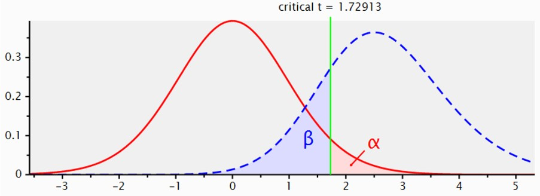
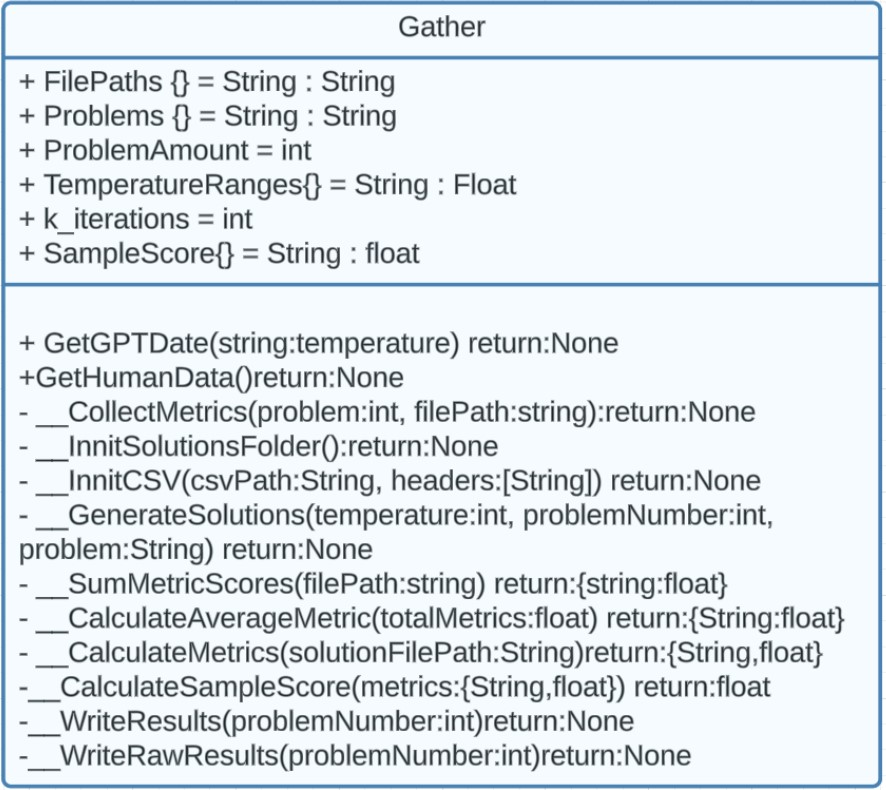
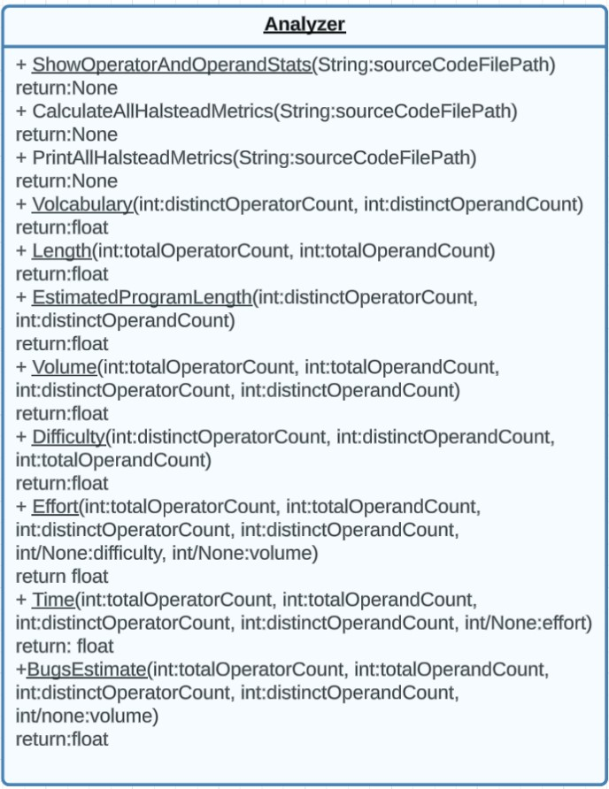
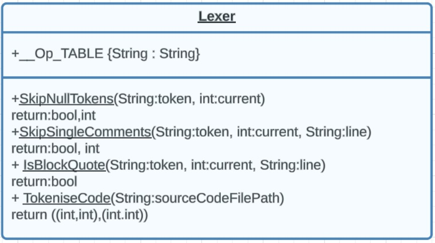
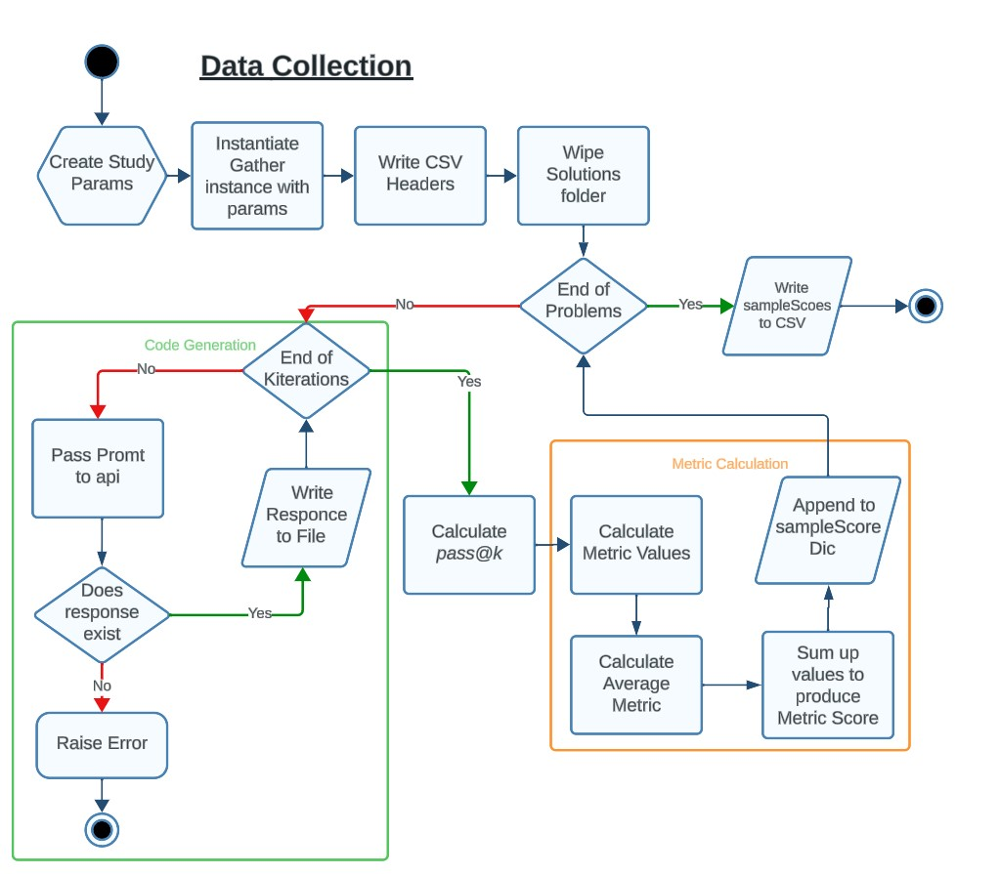
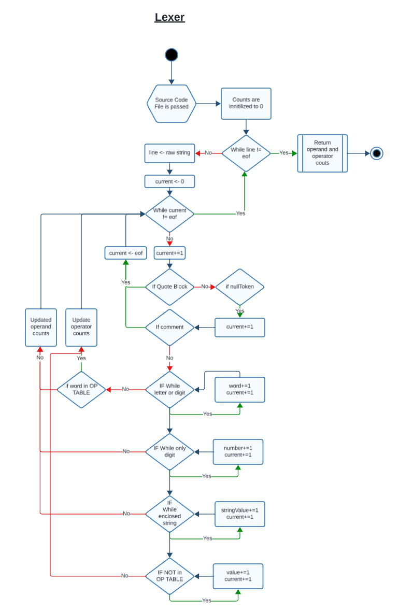

# Can Large Language Models Generate Code That Can Compete With Model, Human-Written Code

## Statistical Analysis

- **Research Questions:** Can Large Language Models generate code for small scale problems that can perform better than model, human-written answers.

- **Null- Hypothesis:** GPT3.5 can generate code for small-scale coding problems that produce an equal or worse total score when compared to model, human answers.

- **Alternative Hypothesis:** GPT3.5 can generate code for small-scale coding problems that produce a greater total score than model, human-written answers.


**Data Collected** 
- Cyclomatic Complexity - (*Ratio Values*)
- Haltead Metrics - (*Ratio Values*)
  - Distinct Operator Count
  - Distinct Operand Count
  - Total Operator Count
  - Total Operand Count
  - Vocabulary
  - Length
  - Estimated Program Length
  - Volume
  - Difficulty
  - Effort
  - Time
  - Bugs Estimate

Each of these values will be taken for each code generation per sample. All values will be summed to produce a final measurement for each sample. This will produce a final set of 20 measurements, valuing the code quality of generations. 

*pass@k* will also be calculated for each sample but not included in the statistical analysis. pass@k is a unbiased estimator for how likely a model can generated code samples that can successfully pass a task. The value will be used to inform the discussion after the study.

**Hypothesis Testing**

A single-sample T-test compares the mean of one set of data against a given mean. The given mean to be used is the mean score of the human answers. 

The parameters of the test are:
- Effect Size = 0.58
- Sample Size = 20
- P-value = 0.05
- Power = 0.8
  
According Cohen,  using a medium effect size of 0.58 results in a effect "visible to the naked eye of a careful observer". A software engineer using generations can be considered a careful observer, so that results in practically relevant.




For a T-test to be valid, the data must be normally distributed. This can be assured with a Shapiro-Wilk test. 

All tests will be calculated in R using the 'ggpubr' and 'dplyr' library's. The code is shown below.

```
# Shapiro Test
#If p is > alpha then data is not significantly different from the normal distribution
with(testData, shapiro.test(testData$gpt))
```
The Human Mean

```
# Calculate Human mean for single test
humanMean <- testData$human
result.mean <- mean(x)
```

T-test

```
# One Sample t-test
res = t.test(testData$gpt,mu = result.mean, alternative="less")
res
```

Data will be displayed using a Box and Whisker plot of the two groups: Human and Generated.

```
group_by(data, group) %>%
  summarise(
    count = n(),
    mean = mean(score, na.rm = TRUE),
    sd = sd(score, na.rm = TRUE)
  )

# Plot Data
ggboxplot(data, x="group", y="score",
          color = "group", palette = c("#53A2BE","#BF5454"),
          ylab = "Score", xlab = "Groups"
          )
```

Normality can be vied through a Density plot and a Q-Q Plot
```
# Q-Q Plot
ggqqplot(SampleResults$Score, ylab = "GPT Answers", xlab = "Human",
         ggtheme = theme_minimal())

# Density Plot
ggdensity(SampleResults$Score,
          main = "Density Plot of Generated Scores",
          xlab = "Generated Scores")
```

## Quality Assurance

**Documentation**

The software will be written in tangent to thorough documentation of each class and method. All following the Pep Python guidelines (https://peps.python.org/pep-0008)
Every method and class will be documented with accurate docstrings.

Files will be organized into a logical file structure with entry to the program being ```main.py```
- ```/Code``` Containing all files required for generation and analysis
- ```/Code/data``` Containing the .csv files for the calculated results and R code for subsequent analysis.
- ```/HumanSolutions``` & ```GeneratedSolutions``` Contains the folder for human written and generated code solutions
- ```/Tests``` Contains all code and code examples for testing 
- ```/Paper``` contains dissertation documentation

**Software Lifecycle**

Development will take strong inspiration from test-driven approaches. The programs flow and key components
will be designed before implementation.
Software implementation will have a 4-step process

4 Steps
- Design
- Implement the simplest code in working form 
- Write Tests
- Refactor/Debug/Iterate

Halstead, cyclomatic complexity and _pass@k_ cannot be changed from their original design. 
The rest of the code base is more flexible and iterative in its design and implementation. 

**Test Plan**

To assure rigor in the study, the code base will go through several stages of testing.

Each individual method within the curial classes ```Lexer```, ```Analyzer``` and ```Gather``` will be tested using unit tests. This testing will make use of the python library ```unittest```.

**Unit Tests** will be kept simple, with very little or ideally no logic involved. This is to ensure that the tests can be trusted to provided true results and don't need their own tests. Multiple unit test per method will keep the tests simple and provide complete coverage of inputs, including edge cases. 

**Stress Testing** will be used to ensure that the lexer can handle large inputs, larger than any code the *should* be generated. For this, very large python file will be passed through into the lexer. All unit tests for the lexer will have hand-counted operands and operators to ensure valid results.

**Integration Testing** will be used to test that methods can be used together. This testing will take a bottom-up approach. Starting with 2 method combinations and working up to the entire artefact. This will serve two purposes. 
- Test that all methods work with other methods in their chain.
- Provide specific insights to aid and speed up the debugging process.

**Regression Testing** will test all feature that already are working, still work after a change to the code base. Using git branching, 
major changes or new features will be developed on a different branch to the working main. When they are merged, regression testing ensures that the 
new changes haven't broken any preexisting . 


# Artefact Diagrams
### Class Definitions 







### Program Flow

**Data Collection**
This is an overview of the entire program. Only the key sections have been included for brevity.



Some While and Ifs statements have been combined into IF-WHILE blocks to compact the diagram. The lexer flows through each character as a token, *current* representing the current token on each line



