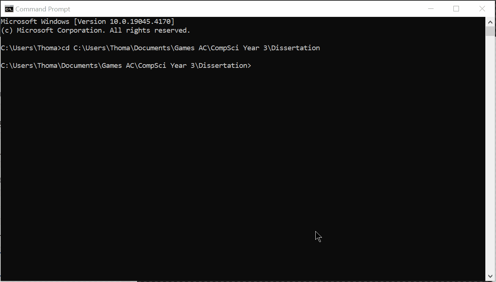

# What is this?
This project is the software for my Computer Science Dissertation at Falmouth University, 2024. The repo contains all code files, data collection, data analysis and write-up.

**Research Question:** Can GPT3.5 generate code that scores higher than university programming students in code-quality metrics.

The purpose of this code base is to provide a streamlined pipeline to generate hundreds of code solutions for *n* questions and collect code-quality metrics based on those soltuions. Data for human-written code solutions can also be collected.

**main.py** runs is the root file to run the project from. To get detailed usage, use the help command:

```bash
main.py --help
```
Full arguments and their properties are shown in the [Argument](#CLI-Arguments) section further bellow. A descriptor of the code-base is given in the [Navigation](#Navigation) section further bellow.
## CLI Arguments
To generate solutions, you will need to add `API_KEY` to environment variables, which contains your OpenAI API secret [key](https://platform.openai.com/api-keys).

| Name | Alt's | Type | Description |
| :-------- | :------- | :------------------------- | - |
`--dataCollection` | `-dc` | [`gen` \| `h`] |Collects data for the given dataset, either generation or human.
Cannot be used with -c|
`--cleanFailedSolutions` | `-c`, `-clean`| `Boolean Flag` | Flag to clean data of failed solutions.
Cannot be used with -dc |
`--sampleCollection`|`-sc`| `Boolean Flag` | Flag to collect code generation solutions. **Requires** -t & -k|
`--temperature` | `-t` | `Float value` | Value of model of generation, **0 < T <= 1**|
`--K_iterations` | `-k` | `Int Value` | Number of generations per questions & K in pass@k, **1 <= K <= 100** |
`--help` | `-h` | `Boolean Flag` | Shows all args and their helper methods |
## Usage Examples

#### Generate 10 samples per question, at a temperature of 0.6
```bash
main.py -sc -k 10 -t 0.6
```
#### Load in Human Samples
```bash
load_human_solutions.py
```
#### Gathers data for generated samples
```bash
main.py -dc gen
```
#### Gathers data for human samples
```bash
main.py -dc h
```
#### Cleaning Data of Failed Solutions
```Bash
main.py -c
```
#### Running Tests
```bash
  TestRunner.py
```

### Example

## Navigation

Bellow is a brief description of the code base and how modules relate to each other. This is not important for usage of the program, but important for understanding and potential forking.

<details>
<summary> <b>/Root Dir</b> </summary>
<li> <i>main.py</i> Runs is the root module to run the project from. All args follow from this module</li>
<li> <i>TestRunner.py</i> Runs system unit tests</li>
<li> <i>load_human_solutions.py</i> Loads in human solutions using paths in config</li>
<li> <i>Requirements.txt</i> Stores all python requirements </li>
<li> <i>config.py</i> Holds global variables used accross the system, including access to env api keys & file paths.</li>
<li> <i>.gitignore</i> Excludes mostly cheche files and solution directories</li>
</details>

<details>
<summary> <b>/Code</b> </summary>
<ul>
  <li> <i>Gather.py</i> Main class for collecting data. Generates samples and performs data collecting on said sampless</li>
  <li> <i>Analyzer.py</i> Calculates Halstead Metrics for given file</li>
  <li> <i>Functionality.py</i> Tests the functionality/validity of python files</li>
  <li> <i>Generation.py</i> Generates code samples using OpenAI API</li>
  <li> <i>Lexer.py</i> Extracts operands and operators from valid python files, ready to use in Halstead calculations</li>
  <li> <i>mccabe.py</i> Calculates Cyclometric Complexity for a given python file</li>
  <li> <i>DataHelper.py</i> Contains helper methods for sample generation and data collection</li>
  <li> <i>CleanData/py</i> Module providing methods to clean data of failed solutions</li>
  <li> <i>ProblemQuestions.json</i> Containing the problem Stores</li>
  <li> <i>stats.R</i> containing the R code used in the studies analysis</li>
</ul>
</details>

<details>
  <li><i>/Data</i> Directory of all data used in and collected from the system. </li>
    <ul>
      <li> Generation and Sample <i>.csv</i> result files</li>
      <li> Raw Generation and Raw Sample <i>.csv</i> result files</li>
      <li> Back up of sample data, used in cleaning, deleted after use</li>
    </ul>
  <li><i></i></li>
</details>

<details>
<summary> <b>/Logs</b> </summary>
<li> <i>Main.log</i> Master log for the program, should be your first stop for debugging</li>
<li> <i>Results.log</i> Contains all results from any --dataCollection command.</li>
<li> <i>MainSystemTests.log</i> Contains results from system testing</li>
</details>

<details>
<summary> <b>/Tests</b> </summary>
<li> <i>/TestFiles</i> Contains dummy python scripts for testing</li>
<li> <i>/SystemTest</i>s Contains test files, called by TestRunner.py, that test the functionality of the System.</li>
<li> <i>ProblemTests.py</i> Contains test classes and class access for functional testing of samples</li>
<li> <i>MethodTestFile.py</i> Blank file thats used to load samples onto for functional testing</li>
</details>

## Acknowledgements
 - Professor Joe Walton-Rivers & Sokol Murturi for guidance and support throughout the project
 - [McCabe Complexity Checker](https://nedbatchelder.com/blog/200803/python_code_complexity_microtool.html) | [Repo](https://github.com/PyCQA/mccabe)

[](https://choosealicense.com/licenses/mit/)
